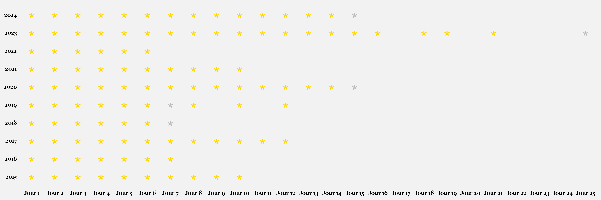

<h1 align="center"> 🎄 Advent Of Code Solutions in R 🎅🏼 </h1>

----

🇬🇧 This repository contains my solutions to the [Advent of Code](https://adventofcode.com) challenges implemented using **R**.

🇫🇷 Ce dépôt contient mes solutions aux défis de l'[*Advent of Code*](https://adventofcode.com) implémentées en **R**.

### Overview / Aperçu 🔍

🇬🇧 Advent of Code is an annual coding event that consists of a series of programming puzzles. Each day, a new challenge is released, and participants are tasked with solving it using their programming skills. This repository showcases my solutions to these challenges, specifically implemented in R.

🇫🇷 *Advent of Code* est un événement annuel de codage qui consiste en une série de casse-têtes de programmation. Chaque jour, un nouveau défi est publié, et les participants sont chargés de le résoudre en utilisant n'importe quel langage de programmation. Ce dépôt présente mes solutions mises en œuvre en R à ces énigmes.

### Repository structure / Structure du dépôt 📦

🇬🇧 The repository is structured as follows:

-   **`20XX/`**: Directory for each year's solutions.
    -   **`DayXX.R`**: R script for solving the challenge of Day XX.

🇫🇷 Le dépôt est structuré comme suit :

-   **`20XX/`** : Répertoire pour les solutions de chaque année.
    -   **`DayXX.R`** : Script R pour résoudre le défi du Jour XX.

### Progress / Progression 🚀

